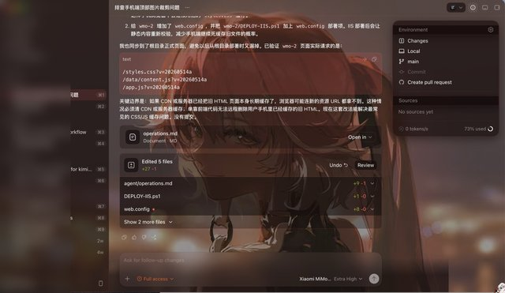
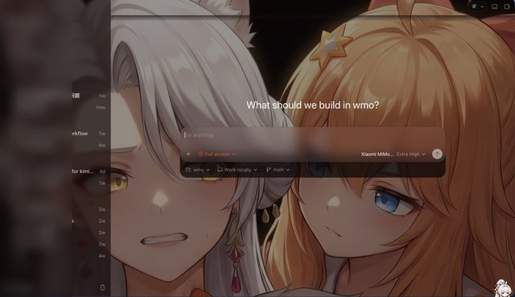
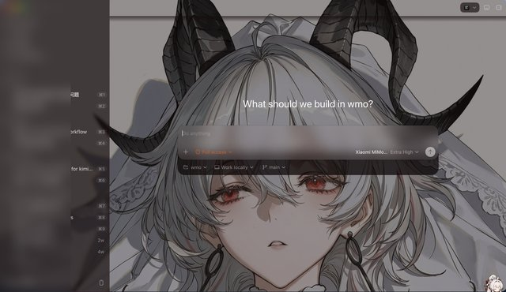
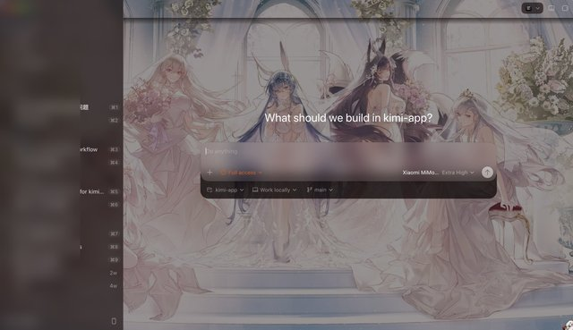
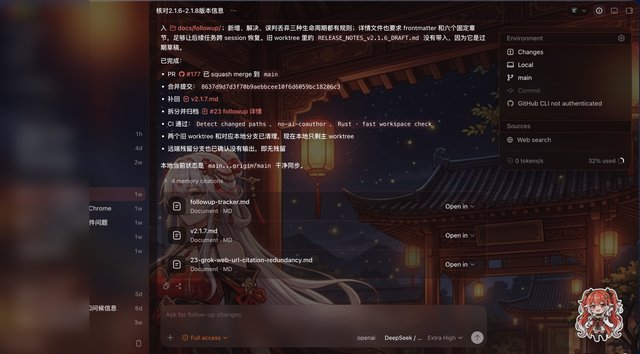

# Agent Theme

> [!NOTE]
> 🎨 **Agent Theme** is a standalone theme companion app for Codex Desktop / Antigravity.
> It injects custom CSS into the agent's WebView via Chrome DevTools Protocol, creating frosted-glass + character background visual themes.
> Comes with 5 built-in themes, supports custom upload & crop — one-click theming without modifying agent source code.

<p align="center">
  <a href="README.md">简体中文</a> |
  <a href="README.en.md">English</a>
</p>

<p align="center">
  <a href="https://github.com/Cmochance/agent-theme/stargazers"></a>
  <a href="LICENSE"></a>
  <a href="https://www.rust-lang.org/"></a>
  <a href="https://v2.tauri.app/"></a>
  <a href="#"></a>
</p>

## Table of Contents

- [Overview](#overview)
- [Features](#features)
- [Built-in Themes](#built-in-themes)
- [Quick Start](#quick-start)
- [Theme Management](#theme-management)
- [Architecture](#architecture)
- [Development](#development)
- [FAQ](#faq)
- [License](#license)

## Overview

Agent Theme is a standalone desktop application (Tauri v2) that works alongside Codex Desktop or Antigravity. It dynamically injects CSS styles via Chrome DevTools Protocol (CDP) to personalize the agent's appearance without modifying any source code.

**How it works:** The agent is launched with the `--remote-debugging-port` flag to expose a CDP port. Agent Theme connects to this port via WebSocket, uses `Page.addScriptToEvaluateOnNewDocument` to inject JavaScript that automatically inserts a background image and semi-transparent CSS overlay on every page load, achieving a frosted-glass visual effect.

## Features

- 🎨 **5 Built-in Themes:** Changli, Nailin, Zani, Azur Lane, Carton — switch with one click
- 🖼️ **Custom Themes:** Drag-and-drop image upload, crop, and save as custom themes
- 🔄 **Multi-Agent Support:** Works with both Codex Desktop and Antigravity, freely switchable
- 🚀 **Scoped Restart:** Companion can restart the selected Codex or Antigravity app with a local debug port
- 🔌 **CDP Injection:** Themes are injected via Chrome DevTools Protocol — safe, reversible, no source modification
- 📊 **Live Status:** Real-time display of agent process status and CDP port binding
- 💾 **Persistent Config:** All settings saved to `~/.codex/agent-theme/config.json`, survives restarts
- 🔒 **Single Instance:** Prevents running multiple companion windows simultaneously

## Built-in Themes

| Theme ID | Chinese | English | Preview |
|----------|---------|---------|---------|
| `changli` | 长离 | Changli |  |
| `nailin` | 奈琳 | Nailin |  |
| `zani` | 扎妮 | Zani |  |
| `azurlane` | 碧蓝航线 | Azur Lane |  |
| `carton` | 纸箱 | Carton |  |

## Quick Start

### Prerequisites

- **macOS** (currently macOS-only; Windows/Linux support planned)
- **Codex Desktop** or **Antigravity** installed

### Installation

1. Download the latest `.dmg` from [Releases](https://github.com/Cmochance/agent-theme/releases)
2. Drag `Agent Theme Companion.app` into your Applications folder
3. On first launch, macOS Gatekeeper may block: right-click the app → choose "Open"; or go to `System Settings → Privacy & Security` and click "Open Anyway"
4. Launch Agent Theme Companion — the interface will display the agent's running status

### Basic Usage

1. **Select Agent:** Choose Codex or Antigravity from the top switch bar
2. **Prepare Debug Port:** If the UI shows `No debug port`, click `Restart App`; the companion will restart the selected agent with local debug-port arguments
3. **Pick a Theme:** Click any theme card in the grid to preview and apply
4. **Toggle Switch:** The "Theme" toggle controls whether styles are injected; turn off to restore the agent's original appearance

### Local Debug Port Requirement

If the agent is already running without a CDP port, Agent Theme cannot inject themes. Clicking `Restart App` stops the currently selected Codex or Antigravity process and starts it again with `--remote-debugging-port=0`.

Process management is scoped to the two supported agent apps. The companion does not clean lock files in the agent app data directory and does not modify the agent app bundle. Once the port is available, keep the "Theme" toggle enabled and click a theme card to inject it.

## Theme Management

### Using Built-in Themes

Built-in themes are stored in the app's `themes/` resource directory. No additional configuration needed — select a theme and it takes effect immediately.

### Creating Custom Themes

1. Click the "+" card in the theme grid
2. Drag an image into the upload area (JPG/PNG, max 20MB)
3. Use the crop tool to adjust the background area
4. Click "Save & Apply" — the theme is saved to `~/.codex/agent-theme/themes/`

### Deleting Custom Themes

Hover over a custom theme card and click the delete button. Built-in themes cannot be deleted.

### Theme File Structure

```json
{
  "id": "changli",
  "displayName": { "zh": "长离 (Changli)", "en": "Changli" },
  "background": "bg.jpg",
  "preview": "preview.jpg",
  "backgroundFit": "cover",
  "backgroundPosition": "center top"
}
```

## Architecture

```
agent-theme/
├── src-tauri/          # Rust backend (Tauri v2)
│   ├── src/
│   │   ├── main.rs     # App entry point
│   │   ├── lib.rs      # Tauri commands registration, lifecycle
│   │   ├── agent.rs    # Agent process detection, launch, management
│   │   ├── cdp.rs      # CDP WebSocket connection, theme inject/clear
│   │   ├── config.rs   # Config read/write (AppConfig)
│   │   └── theme.rs    # Theme discovery, CSS generation, custom theme CRUD
│   └── Cargo.toml
├── web/                # Frontend (Vanilla JS + esbuild)
│   ├── app.js          # Main logic (status polling, theme switching, crop UI)
│   ├── index.html      # Page structure
│   ├── style.css       # Dark red-gold glassmorphism design system
│   └── dist/           # Build output (bundle.js)
└── themes/             # Built-in theme assets
    ├── changli/        # Changli
    ├── nailin/         # Nailin
    ├── zani/           # Zani
    ├── azurlane/       # Azur Lane
    └── carton/         # Carton
```

**Core tech:**

- **Backend:** Rust + Tauri 2.11.2, using `tokio-tungstenite` for CDP WebSocket, `sysinfo` for process detection, `reqwest` for HTTP probes
- **Frontend:** Vanilla JavaScript + esbuild bundling, calling Tauri commands via `@tauri-apps/api`
- **Injection mechanism:** Uses CDP `Page.addScriptToEvaluateOnNewDocument` to inject JavaScript before page load, dynamically creating `<style>` tags and DOM overlays for background image + frosted-glass effect; saves the `identifier` for later removal via `Page.removeScriptToEvaluateOnNewDocument`

## Development

### Requirements

- Rust 1.77.2+
- Node.js 20+
- macOS (currently macOS-only for full dev & debugging)

### Local Build

```bash
git clone https://github.com/Cmochance/agent-theme.git
cd agent-theme

cd web
npm install
npm run build
cd ..

cargo install tauri-cli --version "^2"
cargo tauri dev
```

### CI Checks

GitHub Actions CI is configured with:
- **Rust Checks:** `cargo fmt --check`, `cargo clippy -D warnings`, `cargo check`
- **Frontend Build:** esbuild bundle verification

### Debugging Tips

- The agent's CDP port is written to `~/Library/Application Support/<Agent>/DevToolsActivePort`
- Browse `http://127.0.0.1:<port>/json/list` to see debuggable WebView targets
- Rust logs output to the console via `tauri-plugin-log` — run `cargo tauri dev` in terminal to view

## FAQ

### Q: Theme injection doesn't take effect?

Check the CDP port status in the UI. If it shows `No debug port`, click `Restart App` to relaunch the selected agent in local remote-debugging mode. If a port is available but injection still fails, the UI shows the backend error message.

### Q: Theme doesn't update after switching?

Themes are injected via `Page.addScriptToEvaluateOnNewDocument`, which only takes effect on page **navigation or refresh**. Try switching tabs or refreshing the agent page after changing themes.

### Q: Theme is lost after agent crash/restart?

Yes, CDP-injected themes are lost on agent restart. Agent Theme will automatically re-inject after it detects a reachable local debug port — keep the "Theme" toggle enabled for automatic recovery.

### Q: Is Windows / Linux supported?

Currently macOS only. The `agent.rs` module uses macOS-specific paths (`~/Library/Application Support/`) for process detection. Cross-platform support is planned.

### Q: Does it modify the agent's source code or config files?

No. Theme injection is entirely runtime-based via CDP and does not modify any agent files. The agent returns to its original appearance after injection is cleared.

## License

MIT License. See [LICENSE](LICENSE) for full text.
