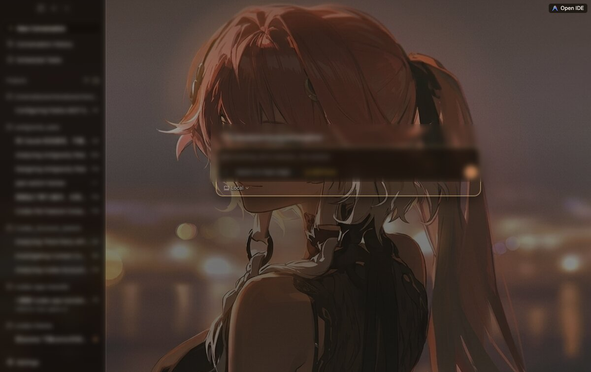
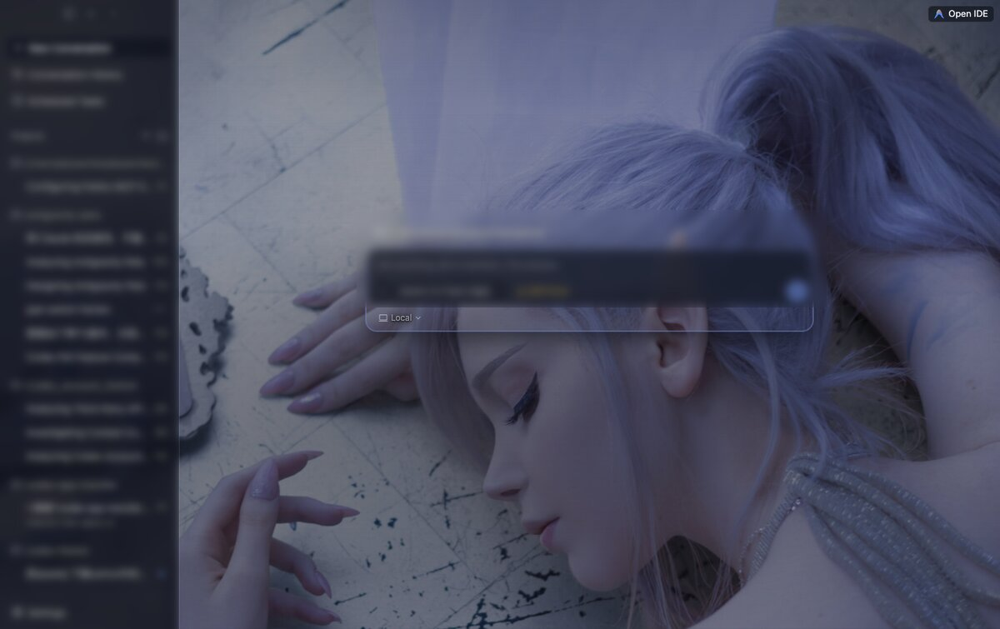

# Agent Theme

> [!NOTE]
> 🎨 **Agent Theme** 是 **Codex Desktop / Antigravity** 的独立换肤伴侣应用。
> 通过 Chrome DevTools Protocol 向代理的 WebView 运行时注入 CSS，实现「角色壁纸 + 磨砂玻璃面板」的视觉主题，**不修改代理任何源码、安全可逆**。
> 内置 **11 套**按背景图独立配色的二次元主题，支持自定义上传裁剪，一键换肤。

<p align="center">
  <a href="README.md">简体中文</a> |
  <a href="README.en.md">English</a> |
  <a href="https://github.com/Cmochance/agent-theme/releases">Releases</a>
</p>

<p align="center">
  <a href="https://github.com/Cmochance/agent-theme/stargazers"></a>
  <a href="LICENSE"></a>
  <a href="https://www.rust-lang.org/"></a>
  <a href="https://v2.tauri.app/"></a>
  <a href="#"></a>
</p>

Agent Theme 是一个独立的桌面应用(Tauri v2)。代理(Codex Desktop / Antigravity)启动时附带 `--remote-debugging-port` 暴露 CDP 端口，本应用通过 WebSocket 连上去，用 `Page.addScriptToEvaluateOnNewDocument` 在页面加载前注入一段脚本：插入背景图层 + 覆盖代理 UI 的设计令牌(design tokens)+ 给各面板加 `backdrop-filter` 磨砂玻璃。整套主题只活在运行时，关掉开关或代理重启即自然消失，**不动代理的 binary、不改任何配置文件**。

## 主题展示

每套主题都按自己的背景图**单独调色**——玻璃从画面暗部取色、强调色取角色的标志色、可读性 scrim 按壁纸亮度逐张校准，让聊天文字在任意壁纸上都清晰，而不是套一个统一的暗色蒙版。下面是 Antigravity 上的实际效果(侧栏与输入框文字已做模糊处理):

| 长离 · Changli | 霜银 · Frost |
|---|---|
|  |  |

内置 **11 套**主题(背景图为各自角色美术，详见[免责声明](#免责声明)):

| ID | 中文名 | English | ID | 中文名 | English |
|---|---|---|---|---|---|
| `changli` | 长离 | Changli | `nocturne` | 夜合 | Nocturne |
| `azurlane` | 碧蓝航线 | Azur Lane | `duet` | 相拥 | Duet |
| `sonata` | 琴奏 | Sonata | `rose` | 暖玫 | Rose |
| `zani` | 扎妮 | Zani | `studio` | 晴室 | Studio |
| `nailin` | 奈琳 | Nailin | `carton` | 纸箱 | Carton |
| `frost` | 霜银 | Frost | | | |

> 同一套主题对 **Codex Desktop** 与 **Antigravity** 均适用——两个代理共享 theme.json 的配色旋钮，各自按平台 UI 结构注入对应的令牌覆盖。

## 功能特性

- 🎨 **11 套内置主题** —— 每套按背景图独立调出暗玻璃 + 强调色 + 分级文字色，一键切换
- 🖼️ **自定义主题** —— 拖拽上传图片 → 1:1 裁剪 → 保存为本地主题
- 🔄 **双代理支持** —— 同时支持 **Codex Desktop** 和 **Antigravity**，顶部切换栏自由选择
- 🚀 **受限重启** —— 一键重启当前代理并附加调试端口参数，仅作用于已支持的两个代理，不碰其它进程
- 🔌 **CDP 运行时注入** —— 通过 Chrome DevTools Protocol 注入，不改代理源码，清除即恢复原样
- 📊 **实时状态** —— 界面实时显示代理运行状态与 CDP 端口绑定情况
- 💾 **配置持久化** —— 设置保存到 `~/.codex/agent-theme/config.json`，重启不丢失
- 🔒 **单实例保护** —— 防止多个伴侣窗口同时运行导致冲突

## 下载与安装

从 [Releases](https://github.com/Cmochance/agent-theme/releases) 下载对应芯片的 `.dmg`(每个附 `.sha256` 校验文件):

| 平台 | 资产 | 说明 |
|---|---|---|
| macOS · Apple Silicon | `Agent-Theme-v<版本>-macOS-arm64.dmg` | M 系列芯片 |
| macOS · Intel | `Agent-Theme-v<版本>-macOS-x64.dmg` | Intel x64 |

下载后把 `.dmg` 里的 App 拖入「应用程序」即可。

### macOS 首次打开(重要)

当前未做 Apple 公证,App 用 **ad-hoc 签名**(已避免「已损坏、无法打开」),但首次打开会被 Gatekeeper 提示「来自身份不明的开发者」——**右键 App → 打开** 一次性放行即可,或到 `系统设置 → 隐私与安全性` 点「仍要打开」。下载完可用 `shasum -a 256 -c <文件>.sha256` 校验完整性。

> **运行平台**:当前**仅支持 macOS**(`agent.rs` 的进程检测与路径依赖 `~/Library/Application Support/`)。Windows / Linux 适配在计划中。

## 快速开始

1. **选择代理** —— 顶部切换栏选 Codex 或 Antigravity
2. **准备调试端口** —— 若界面显示 `No debug port`，点 `Restart App`，伴侣会结束当前代理并以 `--remote-debugging-port=0` 重新拉起
3. **选择主题** —— 在主题网格点任意卡片即时预览并应用
4. **开关主题** —— 「主题开关」控制是否注入；关闭后恢复代理原始界面

> 主题通过 `Page.addScriptToEvaluateOnNewDocument` 注入，**仅在页面导航 / 刷新时生效**。代理重启后注入会丢失，本应用检测到可用端口会自动重新注入,保持开关开启即可。

## 主题管理

### 创建自定义主题

1. 点主题网格里的「+」卡片
2. 拖图片到上传区(JPG/PNG，≤ 20MB)
3. 用裁剪工具调整背景区域
4. 「保存并应用」—— 主题写入 `~/.codex/agent-theme/themes/`

### theme.json 结构

```jsonc
{
  "id": "changli",
  "displayName": { "zh": "长离 (Changli)", "en": "Changli" },
  "background": "bg.jpg",
  "preview": "preview.jpg",
  "backgroundFit": "cover",
  "backgroundPosition": "50% 4%",
  "style": {
    "ink": "#f4ebdf", "ink2": "rgba(244,235,223,.74)",
    "ink3": "rgba(244,235,223,.56)", "ink4": "rgba(244,235,223,.40)",
    "accent": "#e08a55", "accentSoft": "#e6b48a", "focus": "#ffce86",
    "surface": "rgba(26,18,12,.50)",
    "glass": "rgba(30,21,14,.60)", "glassSoft": "rgba(34,24,16,.52)", "glassStrong": "rgba(22,15,10,.78)",
    "border": "rgba(255,228,201,.14)", "borderSoft": "rgba(255,228,201,.07)", "borderStrong": "rgba(255,228,201,.26)",
    "blur": "6px", "hover": "rgba(255,236,210,.10)", "selection": "rgba(255,236,210,.16)",
    "scrimTop": "rgba(18,12,8,.26)", "scrimMid": "rgba(17,11,7,.34)", "scrimBot": "rgba(11,7,5,.60)",
    "baseColor": "#160f0a"
  }
}
```

`background` / `backgroundFit` / `backgroundPosition` 控制背景图本身;可选的 `style` 块是一组与代理无关的**配色旋钮**(`--cl-*`)，Codex 与 Antigravity 两个注入器各自把它翻译成对应平台的令牌覆盖:

- **令牌覆盖** —— 覆盖代理 UI 的语义设计令牌(而非写死的容器选择器)，跟随代理更新不易失效;主表面被透明化以露出背景图。
- **各模块磨砂玻璃** —— 侧栏 / 输入框 / 对话框各用不同不透明度的 `glass*` + `blur` 做 `backdrop-filter`，**实时采样面板背后的同一张图**，从而每个面板的背景天然完美匹配。
- **分级文字配色** —— `ink` / `ink2` / `ink3` / `ink4` 对应正文 / 次级 / 三级 / 禁用;`accent` / `focus` 把链接、焦点、发送键统一成角色主色调。
- **可读性 scrim** —— `scrimTop` / `scrimMid` / `scrimBot` 定义从上到下的暗化渐变。**亮壁纸需要更强的 scrim**(否则聊天文字被画面冲糊)，每套主题按背景图亮度逐张校准。

省略 `style` 时回退到中性暗玻璃默认值(任何背景图都能用)。

## 技术架构

```
agent-theme/
├── src-tauri/              # Rust 后端 (Tauri v2)
│   └── src/
│       ├── lib.rs          # Tauri commands 注册、生命周期、状态
│       ├── agent.rs        # 代理进程检测 / 启动 / 带调试端口重启
│       ├── cdp.rs          # CDP WebSocket 连接、主题注入 / 清除
│       ├── config.rs       # 配置读写 (AppConfig)
│       └── theme.rs        # 主题发现、CSS 生成、自定义主题 CRUD
├── src/                    # 前端源码 (TypeScript + Svelte)
│   ├── App.svelte          # 根组件
│   └── lib/                # types / tauri-commands / stores / actions / polling / components
├── index.html              # Vite 入口
├── web/                    # Vite 构建产物 (Tauri frontendDist)
└── themes/<id>/            # 内置主题资源 (bg.jpg + preview.jpg + theme.json)
```

**核心技术:**

- **后端** —— Rust 1.77+ · Tauri 2.11 · `tokio-tungstenite`(CDP WebSocket)· `sysinfo`(进程检测)· `reqwest`(端口探测)
- **前端** —— TypeScript + Svelte + Tailwind CSS，Vite 构建,`@tauri-apps/api` 调 Tauri commands
- **注入原理** —— CDP `Page.addScriptToEvaluateOnNewDocument` 在页面加载前注入脚本,动态建 `<style>` + 背景层;保存 `identifier` 以便 `Page.removeScriptToEvaluateOnNewDocument` 清除

## 开发指南

```bash
git clone https://github.com/Cmochance/agent-theme.git
cd agent-theme

npm install
npm run build          # Vite 构建前端到 web/

cargo install tauri-cli --version "^2"
cargo tauri dev        # 启动桌面窗口,前端改动自动重编译
```

校验:

```bash
npm run check                       # svelte-check
cargo fmt --check && cargo clippy --all-targets -- -D warnings && cargo test --lib
```

CI(`.github/workflows/ci.yml`)在 PR / push main 时跑 Rust(fmt / clippy / check)+ 前端 Vite 构建。

调试技巧:

- 代理的 CDP 端口写入 `~/Library/Application Support/<Agent>/DevToolsActivePort`(非固定端口)
- `http://127.0.0.1:<port>/json/list` 查可调试的 WebView 目标
- Rust 日志经 `tauri-plugin-log` 输出,终端跑 `cargo tauri dev` 可见

## 常见问题

### 主题注入后不生效?

检查界面上的 CDP 端口状态。显示 `No debug port` 时点 `Restart App` 让代理以远程调试模式重启;端口可用但仍失败时,界面会显示后端返回的错误信息。

### 更换主题后代理界面没更新?

主题在页面**导航 / 刷新**时生效。切主题后切换代理的标签页或刷新页面即可。

### 代理重启后主题丢失?

CDP 注入的主题在代理重启后会丢失。本应用检测到可用调试端口后会自动重新注入,保持「主题开关」开启即可自动恢复。

### 会修改代理的源码或配置吗?

不会。注入完全通过 CDP 运行时完成,不写代理的任何文件;清除注入后代理恢复原始外观。本应用的进程管理范围仅限已支持的两个代理,不清理其锁文件、不改其包内容。

### Antigravity 的代码语法高亮还是浅色?

聊天里**渲染的 markdown 代码块**已被主题重映射为暗色语法配色;但若你打开的是 Antigravity 内嵌的 **Monaco 代码编辑器**,其语法色由 Antigravity 自身的颜色主题决定——把 Antigravity 设为深色主题即可。

## 免责声明

- 本项目是独立的第三方换肤工具,**不是** OpenAI / Google 的官方项目,不复用其商标 / Logo / 发布身份;Codex / Antigravity 为各自所有者的产品。
- 主题注入完全通过 CDP 运行时完成,只连本机 `127.0.0.1` 的调试端口,不接管系统代理、不联网上传、不修改代理文件。
- 内置主题的背景图为相应作品 / 角色的美术作品(如《鸣潮》《碧蓝航线》等),版权归原作者 / 厂商所有,**仅供个人学习与本地外观自定义使用**,请勿用于商业用途或二次分发。如有侵权请开 issue,将及时移除。

## 许可证

MIT License,完整文本见 [LICENSE](LICENSE)。

## 项目活跃度

<p align="center">
  <a href="https://star-history.com/#Cmochance/agent-theme&Date"></a>
</p>
